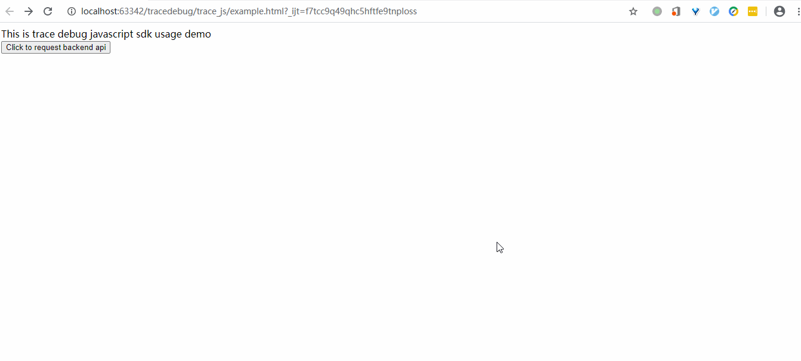
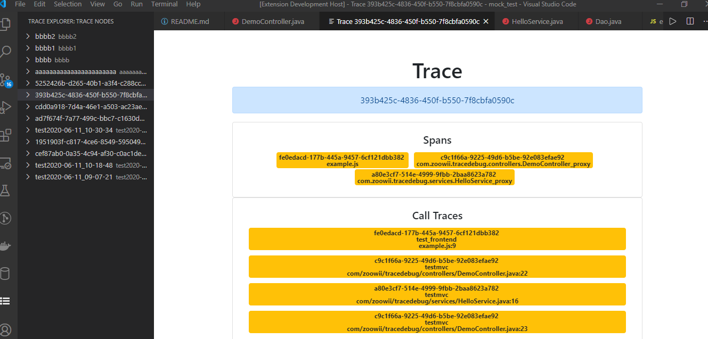

trace-debug
================

日志回溯式分布式系统断点调试器.

# 功能

* 多个组件（比如web前后端以及更多组件）构成的系统，通过sdk自动采样采集运行时日志，然后回溯播放日志并可以在vscode编辑器中进行断点调试

# 组件

* 基于字节码增强的日志埋点java sdk
* 日志埋点 javascript sdk
* 日志回溯调试器的vscode扩展
* 日志回溯式调试器的web后端
* 简单java项目回溯调试的例子
* javascript + spring boot的完整前后端用日志回溯调试的例子

# 样例

* js前端请求java web后端，然后根据日志回溯调试

* 查看trace的调用链路

